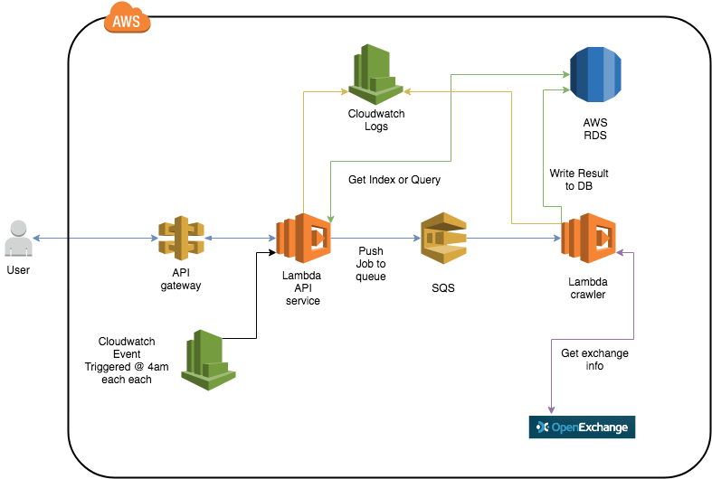

# Exchange App (Backend)

* This is a remake of the exchange app that will be developed in the AWS stack

# The Problem

The problem is to create a service that gives out the latest or historical foreign exchange price based on inputs provided by the end-user.

# The Solution

* An API service will be built in the backend to handle both latest or historical request on the currency exchange. The information will be extracted from the third party API service or Database then returned to the user in a JSON format
* A crawler will also be built to perform scheduled crawler on historical data and they will be stored in database to reduce number of crawls performed on the third party service.

# The Stack
* AWS Lambda (Typescript), SQS, DLQ, Cloud Watch, DynamoDB

# Technical Choice
* Since the API service is not expected to be called on a regular basis, hosting the solution on a cloud server such as AWS EC2 will not the cost effective solution.  Using AWS lambda will provide a on-demand API solution in which the resource will be allocated accordingly.  In addition, the Free-Tier perks for API calls below 1M will keep cost low.
* Horizontal Scaling is provided by Lambda (even though it requires a time to spin up the service) so no need to build the infrastructure.

The design should be as follows:

* The API service lambda is responsible for grabing the exchange information, either from DB or from the API service and return it to the user.

* Another part of this solution is to have an Lambda function spawn task using CloudWatch Event to get the historical price on the previous dates and persist the data in the DB.  For the initial crawl, an API gateway will be setup to spawn one-off multiple crawling task (data should go back to around 1/1/2017) and then persist the data in DynamoDB.

The SQS acts as a temporary buffer which also triggers the Lambda crawler function.

The DLQ should also be used in the case the crawler function receives error response from the third part API service.